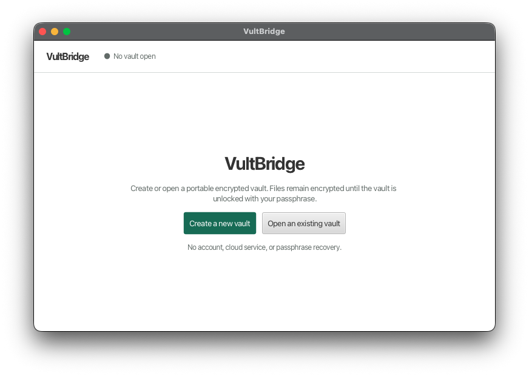
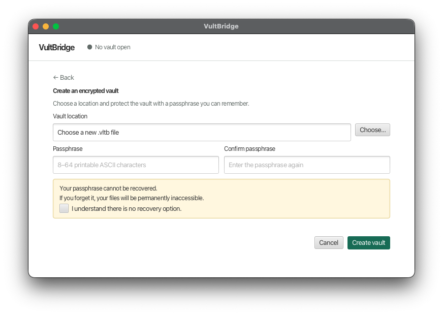
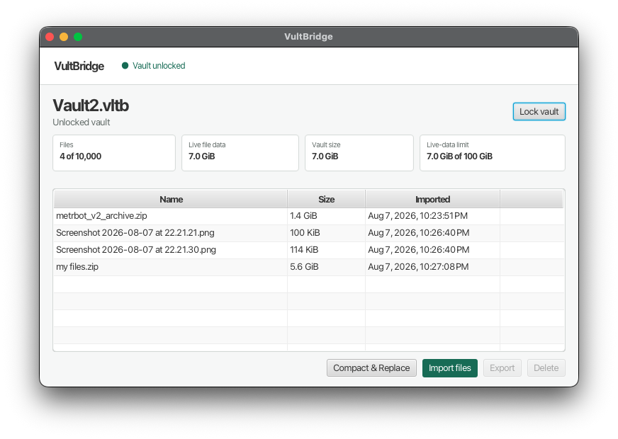

# VultBridge

VultBridge is a local Java desktop application for storing files in one portable, encrypted,
authenticated `.vltb` vault. It has no account, server, recovery key, or passphrase-recovery service.

## Product scope

The MVP provides:

- Vault creation, unlock, lock, close, and manual closed-vault backup.
- Import of regular files into a single flat list.
- Explicit export to ordinary host files.
- Logical deletion and **Compact & Replace** for reclaiming space in a validated replacement vault.
- Up to 10,000 stored files and 100 GiB of live file data per vault.

There is no folder UI, directory import, search, preview, editing, mounting, sync, cloud storage,
or archive extraction. To preserve a directory hierarchy, archive it outside VultBridge and import
the archive as one regular file.

## Technical design

VultBridge is built with Java 21, JavaFX, Gradle, Bouncy Castle, and Jackson CBOR. The code is
organized around explicit boundaries:

```text
app/       JavaFX entry point and scene navigation
ui/        views, dialogs, and metadata-only view models
service/   session ownership and import/export/delete/compact operations
vault/     binary format, records, manifests, commits, and persistence
crypto/    passphrase handling, KDF, key separation, AEAD, HMAC, and wiping
platform/  file dialogs, filesystem policy, sidecar locking, and safe publication
```

The UI receives file metadata and progress only. Passphrases, keys, complete manifest bytes, and
file-content buffers remain outside the UI layer. A bounded background executor performs I/O and
cryptographic work so large files are never loaded into memory as a whole.

## Cryptographic design

- Passphrases are 8–64 printable ASCII characters. They are not persisted and cannot be recovered.
- Argon2id v1.3 derives a 32-byte key using a 16-byte random salt, 65,536 KiB, three iterations,
  and parallelism one. Reader-side bounds reject unreasonable KDF parameters before work begins.
- Each vault has a random 32-byte master vault key (MVK). The passphrase-derived key wraps the MVK
  with ChaCha20-Poly1305 using canonical associated data.
- HKDF-SHA-256 derives a header-MAC key and independent per-record keys from the MVK, vault ID,
  and record ID.
- ChaCha20-Poly1305 authenticates file chunks, manifests, and commits. Header slots use
  HMAC-SHA-256 to authenticate the current commit pointer.

## Storage and durability

A vault is an append-only binary file with a fixed header, encrypted CBOR MANIFEST/COMMIT records,
and encrypted FILE records. File data is streamed in 4 MiB chunks; every chunk is authenticated and
uses associated data containing its role, record ID, index, and exact plaintext length.

Updates append records, force them to storage, then publish the inactive one of two authenticated
commit slots and force again. If an update is interrupted, unlock falls back to the prior valid
commit. Checked 64-bit range arithmetic, strict CBOR parsing, pre-allocation limits, authenticated
record references, and exact stored-length validation protect the parser from malformed vaults.
A same-directory sidecar lock prevents concurrent writers and multiple unlocked sessions.

## Security boundaries

When locked, names and file contents are encrypted and authenticated. The host can still observe
the vault filename, physical size, filesystem timestamps, update timing, and imported-file sizes
exposed by the v1 record framing. While unlocked, a compromised host may capture passphrases, keys,
plaintext, or application memory. Logical deletion does not securely erase old ciphertext, and the
format does not detect rollback to an older valid vault copy. Exported files are unencrypted host
files and must be protected separately.

## Run and build

Use JDK 21 and the Gradle Wrapper:

```bash
./gradlew run
./gradlew test
```

Create a native package for the current macOS or Linux host:

```bash
./gradlew --no-configuration-cache -PreleaseVersion=1.0.0 releasePackage
```

Generated app images, archives, and manifests are written under `build/release/`. Reviewed public
bundles are under `bundle/`; build, verification, and promotion steps are in
[`bundle/build-instructions.md`](bundle/build-instructions.md). The project uses Spotless, JUnit,
Error Prone, SpotBugs, dependency locking, and OWASP Dependency-Check as quality controls. The
dependency inventory is recorded in [`dependency-licenses.md`](dependency-licenses.md).

Current bundle targets are x86_64 macOS and Linux. Runtime filesystem verification currently covers
local APFS on macOS and local ext4 on Ubuntu; network, removable, and other unverified filesystems
are outside the supported boundary.

## License

VultBridge's original source is licensed under the [MIT License](LICENSE). Bundled dependencies
remain under their respective licenses; see the dependency inventory and package notices.

## Screenshots






